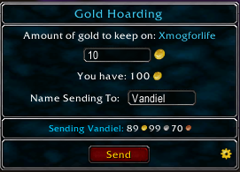
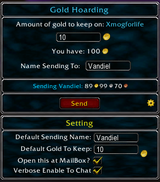
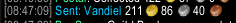

# Gold Hoarding
'Gold Hoarding' is a World of Warcraft addon designed to send gold from your toons from the Mailbox.  Can set toons to hold specific amount of gold and send excess to your 'Gold Hoarder'.

## Features
- Initial

## Contribute
Please report bugs on the [Github Issue Reporting] https://github.com/vandiel01/GoldHoarding/issues/new.

The use of [BugGrabber] https://www.curseforge.com/wow/addons/bug-grabber and [BugSack] https://www.curseforge.com/wow/addons/bugsack will help tremendously with the debugging process.

You can also contribute to the addon by [Donate] https://paypal.me/Vandiel01

## Original Addon (Abandoned)
* Author    : Olivier Pelletier
* Version	 : 1.0.6
* Date		   : 03/18/2015
* Title	   : Every Gold To Banker (EGTB)

## Image Samples
###### Normal Frame
 
###### Normal Frame w/ Setting
 
###### CHAT_MSG Verbose when Sent
 
